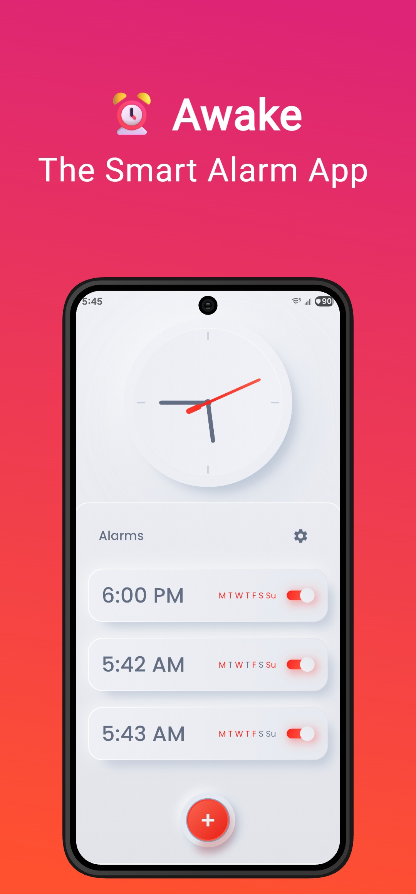
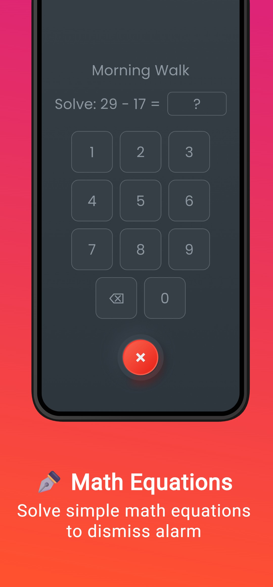
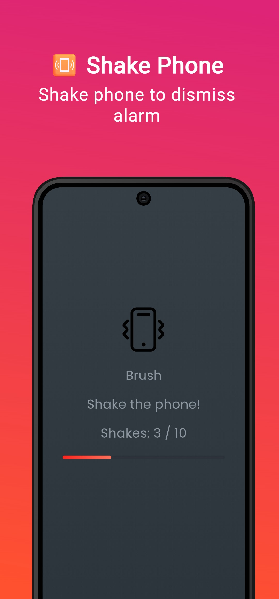
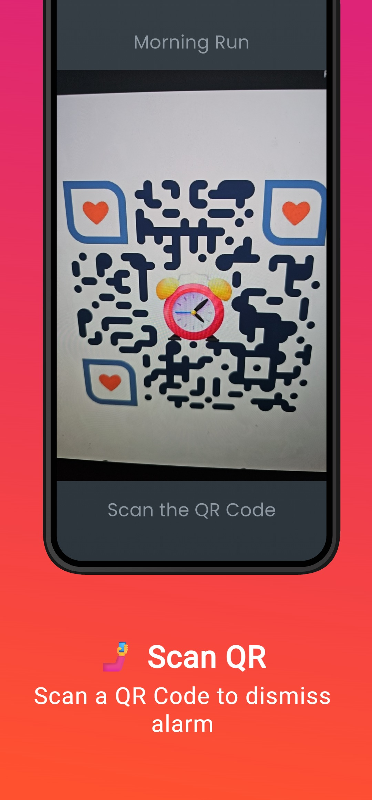
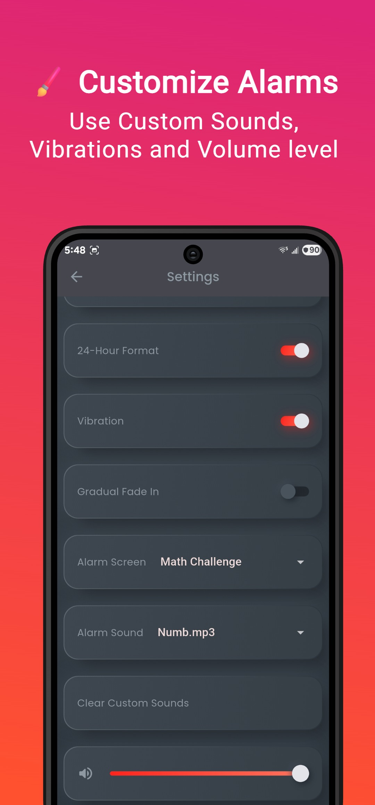
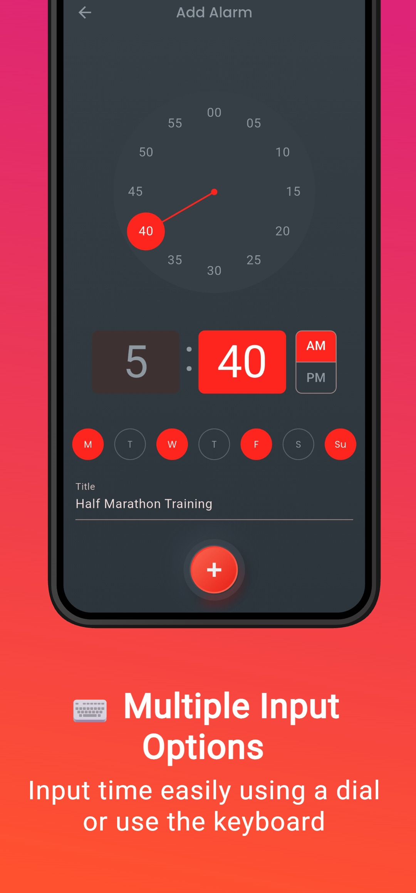
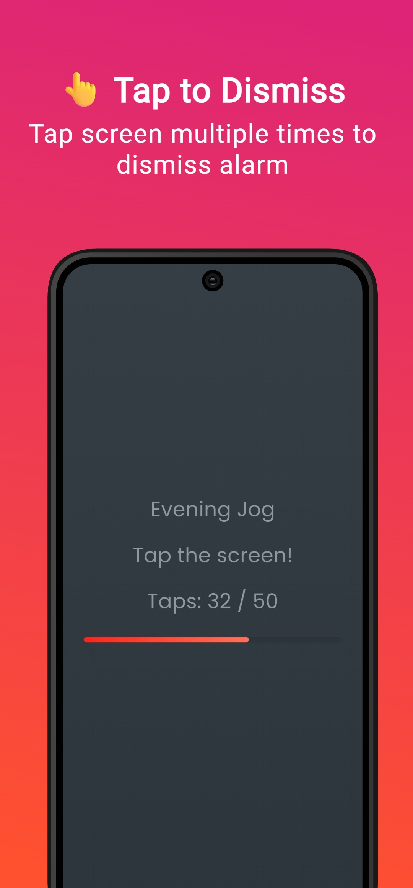
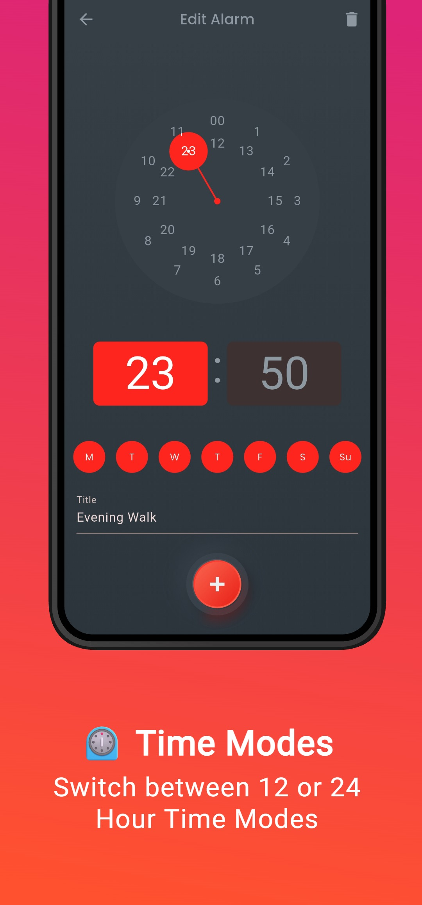

# ⏰ Awake

A modern smart alarm clock.

Awake is a customizable alarm application built with Flutter. Set repeating alarms, choose fun ways to dismiss them and fine‑tune every aspect of how they ring.

If you enjoy using this project please ⭐ star the repo.

## 📸 Screenshots

       

## ✨ Features

- 🌗 Switch between light, dark and system themes.
- 🕑 Toggle 12‑hour or 24‑hour time format.
- 📳 Enable or disable vibration when alarms sound.
- 🔊 Adjustable alarm volume with optional gradual fade in.
- 🎵 Pick custom alarm sounds from your device.
- 🏷️ Add a title to each alarm and manage multiple alarms.
- 🔁 Select the days of the week the alarm should repeat.
- 💤 Snooze alarms for a custom duration.
- ❌ Dismiss alarms in different ways:
  - ⏰ Default ringing screen
  - 🧮 Math challenge
  - 📳 Shake to stop
  - 👆 Tap challenge
  - 🤳 QR code scan (download the code from settings or [Download Link](https://github.com/adeeteya/Awake-AlarmApp/blob/master/assets/qr_code.png))

### 🔜 Upcoming Features

- Widgets and quick actions
- Additional dismissal challenges
- Stopwatch & timer modes

## 💻 Installation links

<table>
  <tr>
    <th>Platform</th>
    <th>Installation Links</th>
  </tr>
  <tr>
    <td>Android</td>
    <td>
      
       
      
       
      
    </td>
  </tr>
</table>

## 🔌 Plugins

| Name                                                                                            | Usage                                  |
|-------------------------------------------------------------------------------------------------|----------------------------------------|
| [**alarm**](https://pub.dev/packages/alarm)                                                     | Schedule and ring alarms               |
| [**device_preview_plus**](https://pub.dev/packages/device_preview_plus)                         | Visualize the app on different devices |
| [**disable_battery_optimization**](https://github.com/adeeteya/Disable-Battery-Optimizations)   | To Make sure AutoStart is enabled      |
| [**file_picker**](https://pub.dev/packages/file_picker)                                         | Pick custom audio files                |
| [**flutter_bloc**](https://pub.dev/packages/flutter_bloc)                                       | State management                       |
| [**flutter_inset_box_shadow_update**](https://pub.dev/packages/flutter_inset_box_shadow_update) | Neumorphic shadows                     |
| [**go_router**](https://pub.dev/packages/go_router)                                             | Routing within the app                 |
| [**lottie**](https://pub.dev/packages/lottie)                                                   | Animations                             |
| [**mobile_scanner**](https://pub.dev/packages/mobile_scanner)                                   | Scan QR codes                          |
| [**path**](https://pub.dev/packages/path)                                                       | Path utilities                         |
| [**path_provider**](https://pub.dev/packages/path_provider)                                     | Locate app directories                 |
| [**permission_handler**](https://pub.dev/packages/permission_handler)                           | Request runtime permissions            |
| [**sensors_plus**](https://pub.dev/packages/sensors_plus)                                       | Detect device shaking                  |
| [**shared_preferences**](https://pub.dev/packages/shared_preferences)                           | Persist user settings                  |
| [**sqflite**](https://pub.dev/packages/sqflite)                                                 | Local database for alarms              |
| [**flutter_lints**](https://pub.dev/packages/flutter_lints)                                     | Recommended lint set                   |
| [**flutter_test**](https://pub.dev/packages/flutter_test)                                       | Unit and widget testing                |

## 🤓 Author

**[Aditya R](https://github.com/adeeteya)**

